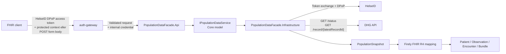

# Arkitektur

## Flyt

I eksplisitt `DevelopmentTestMode` er Swagger/FHIR-siden anonym. Den innkommende token-exchange-flyten erstattes da normalt av en server-side HelseID `client_credentials`-forespørsel med DHG resource/scope og DPoP. En separat Test-only konfigurasjon kan i stedet hente et nytt request-bound `accessTokenJwt`/`dPoPProof`-par fra HelseID TEST-tokenverktøyet for hvert DHG-kall, etter samme mønster som smartOppgave. Modusen er sperret til lokal `Development` sammen med `Dhg:Environment=Test`. Resten av DHG-status/record- og FHIR-flyten er uendret, og testmodusen avvises i alle andre environments og mot Production.

FHIR POST `_search` velger pasient med fødselsnummer i en `application/x-www-form-urlencoded` form body og bruker aldri `X-Patient-Context`. I autentisert drift, inkludert Production, håndheves HelseID `population.read`, og API-laget lager en stabil pseudonym FHIR-ID som `HMAC-SHA-256(PatientIdHmacKey, NIN)`. Nøkkelen er en separat driftshemmelighet; fødselsnummeret eller rå hash eksponeres ikke i FHIR. I lokal `DevelopmentTestMode` er bare allerede konfigurerte syntetiske aliaser tillatt, og aliasets logiske pasient-ID brukes i stedet. GET-query med fødselsnummer støttes ikke i noen environment.

API-laget arbeider bare med `PopulationSnapshot`. DHG JSON-stier, headernavn og wire-kontrakter finnes i Infrastructure. Det gjør at FHIR-kontrakten kan testes uten runtime-mock eller alternativ datakilde.

## Prosjekter og ansvar

| Prosjekt | Ansvar |
|---|---|
| auth-gateway | HelseID access-token, DPoP, scope, replay og privat reverse proxy-grense |
| Core | Kildeuavhengige kliniske verdityper, koder og Firely FHIR-mapping |
| Infrastructure | DHG-kontrakt, status/record-orkestrering, HelseID, DPoP, HTTP-resiliens og kilde-mapping |
| Api | Uavhengig JWT-/gateway-validering, autorisasjon, beskyttet pasientkontekst, FHIR-endepunkter, feilformat og observability |
| Tests | Wire-kontrakt, semantiske mappingregler og in-process HTTP-kontrakt |

## Konsistens og levetid

Hver forespørsel leser `/status` og deretter det oppgitte `latestRecordId`. Record-ID og status `ACTIVE` verifiseres før mapping. Det finnes ingen tverrforespørselscache av pasient- eller tokendata i fasaden. Status og record kan i teorien endres mellom de to kallene; mismatch eller inaktiv record blir en kontrollert feil, ikke et delvis datasett.

## Resiliens

Retries gjelder kun DHG GET og kun nettverksfeil, timeout, 408, 429, 502, 503 og 504. Backoff har jitter og respekterer `Retry-After`. Et `DPoP-Nonce`-challenge kan retries én gang med nytt proof. Andre 401/403 retries ikke. Token exchange gjøres per DHG-kall for å unngå en delt token-cache med brukerbundet materiale.

## FHIR-valg

- `Patient` er minimal og inneholder ikke navn, adresse, fødselsnummer eller annen demografi.
- eksplisitte DHG-fakta blir hovedsakelig `Observation` med korrekt FHIR datatype.
- kontrollbesøk blir `Encounter`; målinger kan referere til besøket.
- nullable boolean mappes bare når verdien finnes. `false` beholdes som `valueBoolean: false`.
- source `lastUpdated` går til `meta.lastUpdated`; måledato går til `effective[x]`.
- ukjente kodesystemer beholdes. Numeriske OID-er normaliseres til `urn:oid:`.
