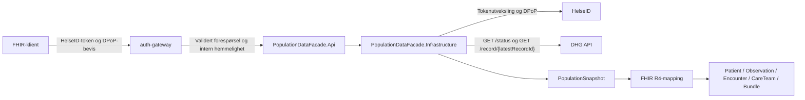

# Arkitektur

## Forespørselsflyt

I autentisert modus validerer gatewayen HelseID-token, DPoP-bevis og påkrevd tilgangsomfang for alle ruter unntatt helsesjekkene. Det private API-et validerer tokenet på nytt og krever gatewayens interne hemmelighet.

`POST /fhir/*/_search` mottar fødselsnummeret i en `application/x-www-form-urlencoded`-kropp. Utenfor `DevelopmentTestMode` kreves HelseID-tilgangsomfanget `population.read`, og API-et lager en pseudonym FHIR-ID med `HMAC-SHA-256`. I lokal `DevelopmentTestMode` godtas bare konfigurerte syntetiske aliaser. Fødselsnummer i URL støttes ikke.

I lokal `DevelopmentTestMode` er API-ets Swagger- og FHIR-ruter anonyme. Modusen godtas bare i `Development` mot DHG Test og med en loopback-lytter. Utgående DHG-kall bruker fortsatt HelseID og DPoP.

API-laget arbeider bare med `PopulationSnapshot`. DHG JSON-stier, headernavn og transportkontrakter finnes i Infrastructure.

Fasaden implementerer ikke `Questionnaire`, `QuestionnaireResponse`, `$populate`, `item.definition` eller `linkId`. Det finnes ingen spørreskjemaspesifikk mapping i kildekoden.

## Prosjekter og ansvar

<table>
  <thead>
    <tr><th width="50%" scope="col">Prosjekt</th><th width="50%" scope="col">Ansvar</th></tr>
  </thead>
  <tbody>
    <tr><td><code>auth-gateway</code></td><td>Validerer HelseID-token, DPoP-bevis, tilgangsomfang og gjenbruk av bevis før videresending til det private API-et</td></tr>
    <tr><td>Core</td><td>Kildeuavhengige kliniske verdityper, koder og FHIR-mapping</td></tr>
    <tr><td>Infrastructure</td><td>DHG-kontrakt, valg av aktivt helsekort, HelseID, DPoP, HTTP-feilhåndtering og kildemapping</td></tr>
    <tr><td>Api</td><td>JWT- og gatewayvalidering, autorisasjon, pasientkontekst, FHIR-endepunkter og feilformat</td></tr>
    <tr><td>Tests</td><td>Transportkontrakt, mappingregler og HTTP-kontrakt</td></tr>
  </tbody>
</table>

## Konsistens og feilhåndtering

Hver forespørsel leser `/status` og deretter posten angitt av `latestRecordId`. Post-ID-en og statusen `ACTIVE` kontrolleres før mapping. Fasaden mellomlagrer ikke pasient- eller tokendata mellom forespørsler. Avvik gir en kontrollert feil og aldri et delvis datasett.

DHG GET-kall prøves på nytt ved nettverksfeil, tidsavbrudd, 408, 429, 502, 503 og 504. Ventetiden har jitter og følger `Retry-After`. En `DPoP-Nonce`-utfordring prøves på nytt én gang med et nytt bevis. Andre 401- og 403-svar prøves ikke på nytt. Tokenutveksling utføres for hvert DHG-kall.

## FHIR-valg

- `Patient` inneholder ikke navn, adresse eller fødselsnummer.
- Eksplisitte DHG-opplysninger mappes til `Observation` når betydningen er entydig.
- Kontrollbesøk mappes til `Encounter`.
- `null` utelates, mens eksplisitt `false` beholdes.
- Kildens `lastUpdated` mappes til `meta.lastUpdated`; måledato mappes til `effective[x]`.
- Kliniske koder kommer fra SNOMED CT, NLK, Volven eller LOINC. Måleenheter bruker UCUM.
- Ukjente kodesystemer, enumverdier og fritekst eksponeres ikke automatisk.
