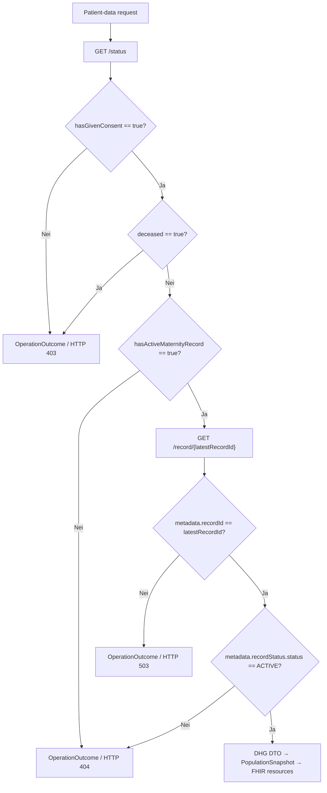

# Mapping fra DHG API til FHIR R4 resources

## Formål og status

Dette dokumentet beskriver FHIR R4 resources som fasaden nå oppretter fra aktiv Digitalt helsekort for gravide (DHG)-record. Det er en implementation contract, ikke en liste over hypotetiske resources. En FHIR resource opprettes bare når angitte source data og gating conditions er oppfylt.

Detaljert begrunnelse for field classification finnes fortsatt i [mapping.md](mapping.md). Consumer-visible coverage og stabile query concepts er dokumentert i [dhg-population-coverage.md](dhg-population-coverage.md).

## Source flow og gating

Fasaden bruker to DHG operations for hver patient-data request:

| DHG operation/field | Bruk i fasaden | FHIR output |
|---|---|---|
| `GET /status` | Kontrollerer consent, deceased status og active-record status, og henter `latestRecordId` | Ingen direkte resource |
| `hasGivenConsent` | Må eksplisitt være `true` før `/record` kalles | Ellers `OperationOutcome` / HTTP 403 |
| `deceased` | Må ikke være `true` | Ellers `OperationOutcome` / HTTP 403 |
| `hasActiveMaternityRecord` | Må eksplisitt være `true` | Ellers `OperationOutcome` / HTTP 404 |
| `latestRecordId` | Velger gjeldende maternity record | Eksponeres aldri som FHIR identifier eller telemetry value |
| `lastChangedDateTime` | Freshness information på snapshot-level | Emittes for øyeblikket ikke som egen resource |
| `GET /record/{latestRecordId}` | Leverer innholdet i maternity record | Mappes som beskrevet nedenfor |
| `metadata.recordId` | Må være lik `latestRecordId` | Mismatch gir `OperationOutcome` / HTTP 503 |
| `metadata.recordStatus.status` | Må være lik `ACTIVE` | Ellers `OperationOutcome` / HTTP 404 |

Det finnes ingen fallback data source og ingen persistent clinical cache.

## Oversikt over FHIR resources

| FHIR resource | Cardinality per vellykket request | Source | Endpoint |
|---|---:|---|---|
| `CapabilityStatement` | 1 | Statisk facade capability | `GET /fhir/metadata` |
| `Patient` | 1 | Logical patient context og safe subset av `mother` | `GET /fhir/Patient/{id}` eller lokal Development POST `_search` |
| `Observation` | 0..* | Eksplisitte DHG clinical fields | `GET /fhir/Observation?patient={id}[&code={system}\|{code}]` eller lokal Development POST `_search` |
| `Encounter` | 0..* | Daterte antenatal appointments uten error | `GET /fhir/Encounter?patient={id}` eller lokal Development POST `_search` |
| `Bundle` | 1 | Search wrapper for Observation- eller Encounter-results | Observation- og Encounter search endpoints |
| `OperationOutcome` | 0..1 | Kontrollert oversettelse av facade-, HelseID- eller DHG-errors | Håndterte failures på mappede FHIR endpoints |

Bare `Patient`, `Observation` og `Encounter` er clinical resources i gjeldende CapabilityStatement. POST `_search` med syntetisk NIN er en lokal `DevelopmentTestMode`-convenience og endrer ikke resource mapping.

## Felles mapping rules

- En DHG resource med `metadata.enteredInError=true` oppretter ingen FHIR resource.
- En nullable DHG boolean oppretter ingen Observation når verdien er `null`. Eksplisitt `false` blir `valueBoolean=false`.
- Source `metadata.lastUpdated` blir `meta.lastUpdated` når verdien finnes.
- Source measurement dates blir `effectiveDate`. Date-time values blir `effectiveDateTime` når det støttes.
- Hver Observation refererer til `Patient/{logical-id}`.
- Appointment-derived Observations refererer også til deres genererte Encounter.
- Observation status er `unknown`, fordi DHG ikke oppgir en FHIR-equivalent result status.
- Encounter status er `unknown`, fordi DHG ikke skiller planned fra completed appointments.
- Stabile facade-owned concepts bruker `urn:nhn:population-data`.
- Verifiserte NLK concepts bruker `urn:oid:2.16.578.1.12.4.1.1.7280`. Verifiserte Volven systems bruker tilhørende `urn:oid:`-verdi.
- Quantities bruker UCUM `http://unitsofmeasure.org`.
- FHIR IDs bruker normalt DHG resource metadata ID med et suffix, sanitert etter FHIR-reglene for tegn og lengde i ID. Manglende metadata IDs bruker `dhg` som fallback. Gjentatte list items inkluderer også position i source array. Slike list-item IDs er derfor bare stabile så lenge source order er stabil.

## Patient

| DHG/context source | FHIR element | Regel |
|---|---|---|
| Logical ID fra protected patient context | `Patient.id` | Aldri avledet fra NIN |
| `mother.metadata.lastUpdated` eller record update time | `Patient.meta.lastUpdated` | Finnes bare når source time finnes |
| `mother.language` | `Patient.communication.language` | Source system/code/display bevares; markeres preferred |
| `mother.needsLanguageInterpreter` | Extension `urn:nhn:population-data:StructureDefinition/needs-language-interpreter` | `valueBoolean`; utelates ved null |

Patient inneholder ikke NIN, navn, adresse, fødselsdato, fødeland, employment information, GP eller andre contact data. `Patient.active` angis ikke, fordi DHG ikke leverer dette fact.

## Encounter

Det opprettes én Encounter for hvert `antenatalAppointments[]` item uten error som har `appointmentDate`.

| DHG field | FHIR element | Mapping |
|---|---|---|
| appointment metadata ID | `Encounter.id` | Stabil sanitert ID |
| appointment metadata update time | `Encounter.meta.lastUpdated` | Source timestamp |
| `appointmentDate` | `Encounter.period.start` og `.end` | Samme calendar date |
| logical patient ID | `Encounter.subject` | `Patient/{logical-id}` |
| — | `Encounter.class` | `AMB` / ambulatory |
| ingen tilsvarende source status | `Encounter.status` | `unknown` |

## Observations etter DHG-område

Når ikke et annet system er oppgitt, bruker Observation code `urn:nhn:population-data`.

### Gjeldende svangerskap

| DHG field | Observation code | FHIR value |
|---|---|---|
| `dateLastPeriod` | `date-last-period` | `valueDate` |
| `dueDate` | `due-date-last-period` | `valueDate` |
| `dueDateBasedOnUltrasound` | `due-date-ultrasound` | `valueDate` |
| `numberOfFetuses` | `number-of-fetuses` | `valueInteger` |
| `assistedConception.hadAssistedConception` | `assisted-conception` | `valueBoolean` |
| `assistedConception.dateAssistedConception` | `assisted-conception-date` | `valueDate` |
| `hasPrenatalDiagnosticsTests` | `prenatal-diagnostics-information` | `valueBoolean` |
| `birthPreparationTalk` | `birth-preparation-talk` | `valueBoolean` |
| `breastfeedingGuidance` | `breastfeeding-guidance` | `valueBoolean` |

`dueDateCorrectedDate` eksponeres ikke, fordi clinical precedence og reason ikke er tilstrekkelig definert for denne fasaden.

### Tidligere svangerskap

| DHG field | Observation code | FHIR value |
|---|---|---|
| `numberOfPreviousPregnancies` | `previous-pregnancies` | `valueInteger` |
| `numberOfPreviousLiveBirths` | `previous-live-births` | `valueInteger` |
| `spontaneousMiscarriages` | `spontaneous-miscarriages` | `valueInteger` |
| `stillBirths22weeks` | `stillbirths-22-weeks` | `valueInteger` |
| `numberOfEctopicPregnancies` | `ectopic-pregnancies` | `valueInteger` |
| `note` | `previous-pregnancy-note` | `valueString`, unparsed |

Ingen induced-abortion value utledes fra tellerne.

### Genetic disorders og medical conditions

| DHG field group | Observation code | FHIR value |
|---|---|---|
| `geneticDisorders.noneKnown` | `genetic-none-known` | `valueBoolean` |
| `parentsAreRelatives` | `parents-are-relatives` | `valueBoolean` |
| `hipDysplasia` | `hip-dysplasia` | `valueBoolean` |
| `other` | `other-genetic-disorder` | `valueBoolean` |
| genetic `note` | `genetic-note` | `valueString`, unparsed |
| hver eksplisitt `medicalConditions` boolean | `medical-condition-{field}` | `valueBoolean` |
| medical `note` | `medical-conditions-note` | `valueString`, unparsed |

Medical-condition suffixes er `nothing-particular`, `heart-disease`, `high-blood-pressure`, `kidney-urinary-tract`, `diabetes`, `allergies-asthma`, `epilepsy`, `thrombosis`, `autoimmune-disease`, `gynecological-conditions`, `mental-health` og `other`. Det kombinerte `allergiesAsthma` fact splittes aldri i separate diagnoses.

### Medication og folate

| DHG field | Observation code | FHIR value/category |
|---|---|---|
| `medicationFrequency` | `medication-frequency` | `valueCodeableConcept`, `therapy` |
| `drugAllergy` | `drug-allergy` | `valueBoolean` |
| `folate.takenBefore` | `folate-before-pregnancy` | `valueBoolean` |
| `folate.takenDuring` | `folate-during-pregnancy` | `valueBoolean` |

Medication note kan beholdes som annotation på frequency Observation, men parses aldri til medicine name, dose, `Medication` eller `MedicationStatement`.

### Lifestyle factors

Hvert `lifestyleFactors.stimuli[]` item med en source code oppretter én `social-history` Observation:

- `Observation.code` og `valueCodeableConcept` bevarer source stimulus code, normalt Volven 8536.
- Components bevarer frequency codes for first consultation og week 36, normalt Volven 8537.
- Daily counts blir integer components.
- Source note kan beholdes som unparsed annotation.

### Clinical tests

| DHG field | Observation code system/code | FHIR value/unit |
|---|---|---|
| `hemoglobin` | facade `hemoglobin-first-trimester` | `valueQuantity`, UCUM `g/dL` |
| `hemoglobinAt3rdTrimester` | facade `hemoglobin-third-trimester` | `valueQuantity`, UCUM `g/dL` |
| `ferritin` | NLK `NPU19763` | `valueQuantity`, UCUM `ug/L` |
| `hbv` | facade `hbv-s-antigen-positive` | `valueBoolean` |
| `hbvCore` | facade `hbv-core-antibody-positive` | `valueBoolean` |
| `hiv` | NLK `NPU19649` | `valueBoolean` |
| `syphilis` | NLK `NPU03611` | `valueBoolean` |
| `aboRh.aboType` | facade `abo-blood-type` | `valueCodeableConcept` |
| `aboRh.rhesusDType` | facade `maternal-rhesus-d` | `valueCodeableConcept` |
| `bloodAntibodies` | facade `blood-antibodies` | `valueBoolean` |
| `chlamydia` | NLK `NPU12331` | `valueBoolean` |
| `toxoplasmosis` | facade `toxoplasmosis-positive` | `valueBoolean` |
| `rubellaAntigen` | NLK `NPU12412` | `valueBoolean` |
| `hepatitisC` | NLK `NPU12033` | `valueBoolean` |
| `mrsaVreEsbl` | facade `mrsa-vre-esbl` | `valueBoolean` |
| `bHbA1c` | NLK `NPU27300` | `valueQuantity`, UCUM `mmol/mol` |
| `glucoseTolerance.fastingGlucoseLevel` | facade `glucose-tolerance-fasting` | `valueQuantity`, UCUM `mmol/L`; test date som `effectiveDate` |
| `glucoseTolerance.post2hGlucoseLevel` | facade `glucose-tolerance-2h` | `valueQuantity`, UCUM `mmol/L`; test date som `effectiveDate` |
| `gonorrhea` | facade `gonorrhea` | `valueBoolean` |
| `cytomegaloVirus` | facade `cytomegalovirus` | `valueBoolean` |
| `asymptomaticBacteriuria` | facade `asymptomatic-bacteriuria` | `valueBoolean` |
| `groupBStreptococci` | NLK `NPU18725` | `valueBoolean` |

Generell clinical-tests note knyttes ikke til enkeltresultater. Facade codes brukes der DHG boolean ikke identifiserer én entydig laboratory analysis.

### Rhesus D negative pathway

| DHG field | Observation code | FHIR value |
|---|---|---|
| `consentFetalRhesusTyping` | `rhd-consent-fetal-typing` | `valueBoolean` |
| `fetusRhDPositiveAtWeek24` | `fetus-rhd-week-24` | `valueBoolean`; `dateForResult` som `effectiveDate` |
| `dateForResult` | `fetus-rhd-result-date` | `valueDate` |
| `prophylaxisAtWeek28` | `rhd-prophylaxis-week-28` | `valueBoolean` |

### Measurements før pregnancy og symphysis-fundal height

| DHG field | Observation code | FHIR value/category |
|---|---|---|
| `height` | `pre-pregnancy-height` | `valueQuantity` UCUM `cm`, `vital-signs` |
| `prePregnancyWeight` | `pre-pregnancy-weight` | `valueQuantity` UCUM `kg`, `vital-signs` |
| `bMI` | `pre-pregnancy-bmi` | `valueDecimal`, `vital-signs` |
| `symphysisFundalHeights[].measurement` | `symphysis-fundal-height` | `valueQuantity` UCUM `cm`, `vital-signs` |
| SFH `measurementDate` | — | Observation `effectiveDate` |
| SFH `pregnancyWeek` | component `gestational-weeks` | component `valueInteger` |

### Observations fra antenatal appointments

Hvert item nedenfor dateres med `appointmentDate` og refererer til tilhørende Encounter.

| DHG field | Observation code | FHIR value/category |
|---|---|---|
| `pregnancyWeek` + `daysAfterFullPregnancyWeek` | `gestational-age-at-appointment` | `valueString` `week+day` med integer components, `survey` |
| siste daterte appointment med gestational age | `recorded-gestational-age` | Samme representation; maksimalt én per snapshot |
| `motherWeight` | `mother-weight` | `valueQuantity` UCUM `kg`, `vital-signs` |
| parseable `bloodPressure` | `blood-pressure` | Opprinnelig `valueString` med systolic/diastolic Quantity components i `mm[Hg]`, `vital-signs` |
| `proteinInUrineTestResult` | NLK `NPU04206` | `valueCodeableConcept` fra Volven 8340, `laboratory` |
| `edema` | `edema` | `valueInteger`, `exam` |
| hvert fetus `fetalHeartRate` | `fetal-heart-rate` | `valueQuantity` UCUM `/min`, `vital-signs` |
| hvert fetus `fetalPresentationLie` | `fetal-presentation-lie` | `valueCodeableConcept` som bevarer source code, `exam` |
| hvert fetus `motherFeelsBabyMovements` | `mother-feels-baby-movements` | `valueBoolean`, `exam` |

Appointment medication flag, employment rate, appointment note og fetus note eksponeres ikke nå, fordi deres sikre consumer semantics ikke er definert.

## Search Bundles

Observation- og Encounter-searches returnerer alltid en FHIR `Bundle` med:

- `type=searchset`;
- `total` lik antall matchende resources;
- én `entry` per resource med `search.mode=match`;
- en absolute `fullUrl` avledet fra request-observed scheme, host og path base;
- `timestamp` satt til fasadens response time, ikke DHG source freshness time;
- `total=0` uten entries når en støttet query ikke har en registrert verdi.

Valgfritt Observation `code` filter bruker eksakt `system|code` matching. Fravær av en Observation er ikke det samme som `false`. Lokal POST `_search` velger først en konfigurert syntetisk pasient ved NIN i form body; NIN inngår aldri i returnert Bundle eller resource identifiers.

## Resources som bevisst ikke opprettes

| Potensiell FHIR resource | Gjeldende beslutning |
|---|---|
| `Questionnaire`, `QuestionnaireResponse` | Ikke en del av den generiske fasaden; ingen questionnaire/linkId coupling |
| `$populate` output | Ikke implementert; en ekstern SDC engine spør fasaden |
| `Medication`, `MedicationStatement` | Medication note parses ikke til clinical medication facts |
| `Condition` | DHG booleans/notes promoted ikke til diagnoses |
| `Practitioner`, `PractitionerRole`, `Organization` | `pointsOfContact` er utenfor population-data surface |
| Demographic extensions/resources | Ingen demographics source er tillatt, og sensitive mother fields eksponeres ikke |
| Birth/postpartum resources | `birthStatus` er utenfor første release for active pregnancy |
| `Provenance` | Identity/organization-details fra `lastUpdatedBy` eksponeres ikke |

Tillegg av en ny resource type krever eksplisitt godkjent mapping, oppdatering av CapabilityStatement, privacy/clinical review, documentation update og semantic tests.
