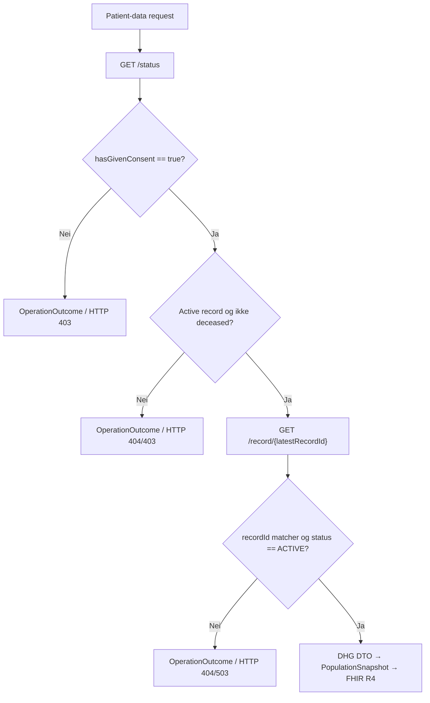
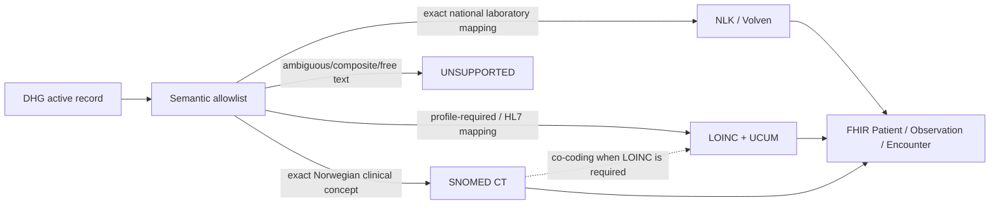

# Mapping fra DHG API til FHIR R4 resources

## Formål og status

Dette dokumentet beskriver FHIR R4 resources som fasaden faktisk oppretter fra active Digitalt helsekort for gravide (DHG) record. Det er en implementation contract, ikke en liste over hypotetiske resources. Detaljert field classification finnes i [mapping.md](mapping.md), og consumer-visible coverage finnes i [dhg-population-coverage.md](dhg-population-coverage.md).

## Source flow og gating

Fasaden bruker to DHG operations per patient-data request:

| DHG operation/field | Bruk | Resultat ved failure |
|---|---|---|
| `GET /status` | consent, deceased status, active record og `latestRecordId` | kontrollert `OperationOutcome` |
| `hasGivenConsent` | må være `true` før record hentes | HTTP 403 |
| `deceased` | må ikke være `true` | HTTP 403 |
| `hasActiveMaternityRecord` | må være `true` | HTTP 404 |
| `GET /record/{latestRecordId}` | eneste runtime clinical data source | HTTP 502/503 ved source failure |
| `metadata.recordId` | må samsvare med `latestRecordId` | HTTP 503 |
| `recordStatus.status` | må være `ACTIVE` | HTTP 404 |

Det finnes ingen fallback data source og ingen persistent clinical cache.

## FHIR resources

| Resource | Cardinality | Source | Endpoint |
|---|---:|---|---|
| `CapabilityStatement` | 1 | statisk server capability | `GET /fhir/metadata` |
| `Patient` | 1 | logical patient context og safe subset av `mother` | Patient read/search |
| `Observation` | 0..* | eksplisitte og semantisk sikre DHG fields | Observation search |
| `Encounter` | 0..* | daterte antenatal appointments uten error | Encounter search |
| `Bundle` | 1 | FHIR search wrapper | search endpoints |
| `OperationOutcome` | 0..1 | kontrollert error translation | alle mapped endpoints |

POST `_search` med NIN i form body krever HelseID i autentisert drift og bruker HMAC-pseudonym patient ID. Lokal `DevelopmentTestMode` bruker konfigurert test alias. Selection method endrer ikke clinical mapping.

## Felles mapping rules

- `metadata.enteredInError=true` gir ingen FHIR resource.
- Nullable boolean gir ingen Observation ved `null`; eksplisitt `false` beholdes.
- Source timestamp blir `meta.lastUpdated` når den finnes.
- Measurement date blir `effectiveDateTime` med day precision. FHIR R4 tillater ikke `date` i `Observation.effective[x]` eller `Observation.value[x]`.
- Alle Observations refererer til `Patient/{logical-id}`. Appointment-derived Observations refererer også til Encounter.
- Observation og Encounter status er `unknown`, fordi DHG ikke leverer en entydig FHIR status.
- `Observation.code` bruker LOINC, SNOMED CT, NLK eller Volven. Facade-specific clinical codes publiseres ikke.
- Quantities bruker UCUM.
- `meta.profile` settes bare når den konkrete resource-instansen oppfyller mandatory profile constraints.
- Unknown code system, enum value eller free text blir ikke automatisk oversatt til en standard code.

## Patient

| Source | FHIR element | Regel |
|---|---|---|
| protected logical ID eller HMAC pseudonym | `Patient.id` | aldri NIN eller raw hash |
| mother/record update time | `Patient.meta.lastUpdated` | bare når source timestamp finnes |
| `mother.language` | `Patient.communication.language` | bare dokumentert Volven 3303 code system |
| `mother.needsLanguageInterpreter` | extension `patient-interpreterRequired` | HL7 canonical URL og `valueBoolean` |

Patient inneholder ikke NIN, name, address, birth date, country, employment, GP eller contact data.

## Encounter

Det opprettes én Encounter for hvert appointment uten error som har `appointmentDate`:

| Source | FHIR element |
|---|---|
| appointment metadata ID | `Encounter.id` |
| update time | `meta.lastUpdated` |
| `appointmentDate` | samme date i `period.start` og `period.end` |
| logical patient ID | `subject=Patient/{id}` |
| facade rule | `class=AMB`, `status=unknown` |

## Observation terminology og value types

Tabellen viser hovedmappingene. Fullstendig DIRECT/PARTIAL/UNSUPPORTED classification finnes i [mapping.md](mapping.md).

| DHG fact | `Observation.code` | FHIR value |
|---|---|---|
| last menstrual period | LOINC `8665-2` | `valueDateTime` med day precision |
| due date from last period | SNOMED CT `289206005` + LOINC `11778-8` | `valueDateTime` med day precision |
| due date from ultrasound | SNOMED CT `738070007` + LOINC `11778-8` | `valueDateTime` med day precision |
| number of fetuses | SNOMED CT `246435002` | `valueInteger` |
| assisted conception | SNOMED CT `813541000000100` | `valueBoolean`; explicit date kan bli `effectiveDateTime` bare ved true status |
| childbirth/breastfeeding education | SNOMED CT `702396006` / `243094003` | `valueBoolean` |
| previous pregnancy counters | LOINC/SNOMED CT exact count concepts | `valueInteger` |
| consanguinity | SNOMED CT `842009` | `valueBoolean` |
| selected medical conditions | exact broad SNOMED CT disorder concept | `valueBoolean` |
| drug allergy / folic acid intake | SNOMED CT `416098002` / `792807003` | `valueBoolean` |
| lifestyle stimulus/frequency | Volven 8536 / 8537 | `valueCodeableConcept` |
| hemoglobin | NLK `NOR05172` | UCUM `g/dL` Quantity |
| ferritin / HbA1c | NLK `NPU19763` / `NPU27300` | UCUM Quantity |
| HBV surface antigen | SNOMED CT `165806002` | kodeverk 8340 `T002 |Positiv|` / `T008 |Negativ|` |
| ABO / RhD | NLK `NPU58582` / `NPU21917` + LOINC `883-9` / `10331-7` | SNOMED CT `valueCodeableConcept` |
| glucose tolerance | SNOMED CT `271062006` / `49167009` | UCUM `mmol/L` Quantity |
| anti-D prophylaxis status | SNOMED CT `408783007` | `valueBoolean` |
| body height | SNOMED CT `1153637007` + LOINC `8302-2` | UCUM `cm` Quantity |
| pre-pregnancy weight | SNOMED CT `27113001` + LOINC `29463-7` | UCUM `kg` Quantity; «før svangerskapet» som annotation |
| BMI | LOINC `39156-5` | UCUM `kg/m2` Quantity |
| symphysis-fundal height | SNOMED CT `364253002` | UCUM `cm` Quantity |
| gestational age | LOINC `18185-9` | UCUM `d` Quantity per appointment |
| mother weight | SNOMED CT `27113001` + LOINC `29463-7` | UCUM `kg` Quantity; norsk Body Weight profile når datert |
| blood pressure | LOINC `85354-9` | component-only; SNOMED CT `4471000202106`/`4481000202108` + LOINC `8480-6`/`8462-4`, UCUM `mm[Hg]`; profile codings uten canonical claim |
| urine protein | NLK `NPU04206` | kodeverk 8340 `T008`/`T052`/`T048`/`T049`/`T050` `valueCodeableConcept` |
| edema | — | unsupported til DHG definerer scale semantics |
| fetal facts | — | unsupported til `fosterId` kan representeres som godkjent FHIR `focus`/identifier |

## Profile conformance

Fasaden bruker [Norwegian national Vital Signs](https://hl7.no/fhir/no-domain/vitalsigns/) for de instances der source semantics og mandatory elements er komplette:

| Observation | `meta.profile` | Begrunnelse |
|---|---|---|
| datert mother weight fra appointment | `.../no-domain-VitalSigns-Observation-bodyweight` | norsk SNOMED CT coding, profile-required LOINC, `vital-signs` category, `effective[x]` og UCUM `kg` finnes |
| datert blood pressure med begge components | ingen profile claim | codings beholdes, men `hl7.fhir.no.domain.vitalsigns#0.9.74` har slicing som pinned Firely Terminal `3.5.0` ikke kan kompilere; canonical annonseres ikke uten bestått validation |
| height og pre-pregnancy weight | ingen profile claim | DHG leverer ikke measurement time; profilene krever `effective[x]`, men entydige profile codings beholdes |
| fetal facts | ingen FHIR resource | mother kan være `subject`, men fetus må kunne identifiseres strukturert som `focus`; opaque resource-ID er ikke tilstrekkelig |

Body Weight-eksemplet i `validation/examples` er generert fra samme mapper og låst av en regression test. CI bruker Firely Terminal `3.5.0`, `hl7.fhir.no.domain.vitalsigns#0.9.74` og `hl7.fhir.no.basis#2.2.2`; den offisielle package-filen kontrolleres mot pinned SHA-256 før validation.

[NILAR/Pasientens Prøvesvar](https://github.com/HL7Norway/NILAR) brukes som mapping reference for laboratory Observations: NLK brukes når analysis er entydig og Quantity bruker UCUM. Fasaden deklarerer ikke `NilarObservation` i `meta.profile`. NILAR-profilen krever en `diagnosticreportref` extension til en faktisk `DiagnosticReport` og report-specific bindings som ikke finnes i dagens DHG semantic snapshot. Å legge på profilen uten disse elementene ville vært et feilaktig conformance claim.

## Bevisste exclusions

- `dueDateCorrectedDate` brukes ikke uten en egen clinical precedence decision.
- Assisted-conception date utleder aldri assisted-conception status.
- Combined fields som `allergiesAsthma` og `mrsaVreEsbl` splittes ikke.
- Medication free text blir ikke `Medication` eller `MedicationStatement`.
- Consent og fetal RhD result blir ikke feilaktig representert som mother-subject Observation.
- Unknown source systems/values og unsupported fields eksponeres ikke automatisk.

## Search response

Observation og Encounter search returnerer `Bundle.type=searchset`, `Bundle.total` og entries med `search.mode=match`. Valgfritt Observation `code` filter bruker exact `system|code` matching mot alle publiserte standard `Coding` entries. Fravær av en Observation betyr ikke `false`.

NIN brukes bare i POST form body ved `_search` og inngår aldri i returned Bundle, resource identifiers, logs eller telemetry.
