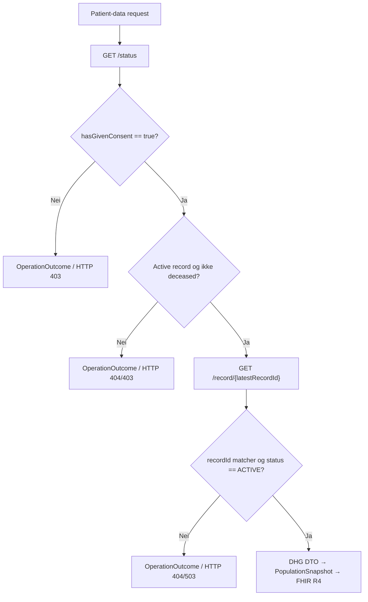
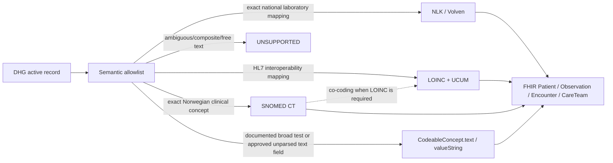
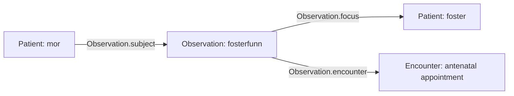

# Mapping fra DHG API til FHIR R4 resources

## Formål og status

Dette dokumentet beskriver FHIR R4 resources som fasaden faktisk oppretter fra active Digitalt helsekort for gravide (DHG) record. Det er en implementation contract, ikke en liste over hypotetiske resources. Detaljert field classification finnes i [mapping.md](mapping.md), og consumer-visible coverage finnes i [dhg-population-coverage.md](dhg-population-coverage.md).

## Source flow og gating

Fasaden bruker to DHG operations per patient-data request:

| DHG operation/field | Bruk | Resultat ved failure |
|---|---|---|
| `GET /status` | consent, deceased status, active record og `latestRecordId` | kontrollert `OperationOutcome` |
| `hasGivenConsent` | må være `true` før record hentes | HTTP 403 |
| `deceased` | må ikke være `true` | HTTP 403 |
| `hasActiveMaternityRecord` | må være `true` | HTTP 404 |
| `GET /record/{latestRecordId}` | eneste runtime clinical data source | HTTP 502/503 ved source failure |
| `metadata.recordId` | må samsvare med `latestRecordId` | HTTP 503 |
| `recordStatus.status` | må være `ACTIVE` | HTTP 404 |

Det finnes ingen fallback data source og ingen persistent clinical cache.

## FHIR resources

| Resource | Cardinality | Source | Endpoint |
|---|---:|---|---|
| `CapabilityStatement` | 1 | statisk server capability | `GET /fhir/metadata` |
| `Patient` | 1..* | mor fra logical patient context og 0..* minimale fetus Patients fra positive `fosterId` | mother search; mother/fetus read |
| `Observation` | 0..* | eksplisitte og semantisk sikre DHG fields | Observation search |
| `Encounter` | 0..* | daterte antenatal appointments uten error | Encounter search |
| `CareTeam` | 0..1 | markert jordmor og maternity healthcare centre fra `pointsOfContact` | CareTeam search |
| `Bundle` | 1 | FHIR search wrapper | search endpoints |
| `OperationOutcome` | 0..1 | kontrollert error translation | alle mapped endpoints |

POST `_search` med NIN i form body krever HelseID i autentisert drift og bruker HMAC-pseudonym patient ID. Lokal `DevelopmentTestMode` bruker konfigurert test alias. Selection method endrer ikke clinical mapping.

## Felles mapping rules

- `metadata.enteredInError=true` gir ingen FHIR resource.
- Nullable boolean gir ingen Observation ved `null`; eksplisitt `false` beholdes.
- Source timestamp blir `meta.lastUpdated` når den finnes.
- Measurement date blir `effectiveDateTime` med day precision. FHIR R4 tillater ikke `date` i `Observation.effective[x]` eller `Observation.value[x]`.
- Alle Observations har morens `Patient/{logical-id}` som `subject`. Fetus-spesifikke Observations har i tillegg det aktuelle fosterets `Patient/{fetus-id}` som `focus`. Appointment-derived Observations refererer også til Encounter.
- Observation og Encounter status er `unknown`, fordi DHG ikke leverer en entydig FHIR status.
- `Observation.code` bruker LOINC, SNOMED CT, NLK eller Volven når en exact mapping finnes. Et dokumentert broad DHG test result kan bruke presis source term i `CodeableConcept.text` uten `Coding`; facade-specific clinical codes publiseres ikke.
- Quantities bruker UCUM.
- Alle Observations bruker standard FHIR R4 `Observation` base resource uten spesialiserte `meta.profile` claims.
- Unknown code system, enum value eller free text blir ikke automatisk oversatt til en standard code.

## Patient

| Source | FHIR element | Regel |
|---|---|---|
| protected logical ID eller HMAC pseudonym | `Patient.id` | aldri NIN eller raw hash |
| mother/record update time | `Patient.meta.lastUpdated` | bare når source timestamp finnes |
| `mother.language` | `Patient.communication.language` | bare dokumentert Volven 3303 code system |
| `mother.needsLanguageInterpreter` | extension `patient-interpreterRequired` | HL7 canonical URL og `valueBoolean` |
| positivt `fetusesVitalSigns[].fosterId` | separat fetus `Patient.id` | pregnancy-scoped SHA-256-derived logical ID basert på maternal logical ID og source `fosterId`; ingen NIN eller raw DHG identifier publiseres |
| appointment source timestamp | fetus `Patient.meta.lastUpdated` | nyeste timestamp for samme `fosterId` beholdes |

Mother Patient inneholder ikke NIN, name, address, birth date, country, employment, GP eller contact data. Fetus Patient er enda mer minimal og inneholder bare `id` og valgfri `meta.lastUpdated`; name, gender, birthDate, identifier og clinical status konstrueres ikke. Et fetus-ID kan leses med `GET /fhir/Patient/{fetus-id}` ved å bruke den samme maternal `X-Patient-Context` som ga Observation-resultatet. Bare foster i den aktuelle maternal snapshot kan løses.

## CareTeam

Når minst ett av de markerte `pointsOfContact`-feltene finnes, opprettes ett patient-scoped `CareTeam` for svangerskapsoppfølging:

| Source | FHIR element | Regel |
|---|---|---|
| `pointsOfContact.metadata` | `CareTeam.id`, `meta.lastUpdated` | `enteredInError=true` utelater hele resource |
| logical patient ID | `CareTeam.subject` | `Patient/{id}`; aldri NIN |
| `midwife.name` | contained `Practitioner.name.text` og `participant.member` | raw text trimmes; ingen directory identity konstrueres |
| `midwife.organizationName` | contained `Organization.name` og `participant.onBehalfOf` | brukes med Practitioner; når personnavn mangler blir Organization participant |
| `maternityHealthcareCentre` | contained `Organization.name` og `participant.member` med text role `Helsestasjon` | raw text trimmes; ingen organization identifier eller managing responsibility konstrueres |

Contained resources er valgt fordi DHG-navn alene ikke er nok til en selvstendig, autoritativ Practitioner- eller Organization-resource. `generalPractitioner`, `birthInstitute`, HPR number og organization ID eksponeres ikke i denne mappingen. FHIR R4 `CareTeam.status=active` uttrykker at kontaktene kommer fra den current active DHG record, ikke at en ekstern directory entry er verifisert.

## Encounter

Det opprettes én Encounter for hvert appointment uten error som har `appointmentDate`:

| Source | FHIR element |
|---|---|
| appointment metadata ID | `Encounter.id` |
| update time | `meta.lastUpdated` |
| `appointmentDate` | samme date i `period.start` og `period.end` |
| logical patient ID | `subject=Patient/{id}` |
| facade rule | `class=AMB`, `status=unknown` |

## Observation terminology og value types

Tabellen viser hovedmappingene. Fullstendig DIRECT/PARTIAL/UNSUPPORTED classification finnes i [mapping.md](mapping.md).

| DHG fact | `Observation.code` | FHIR value |
|---|---|---|
| last menstrual period | LOINC `8665-2` | `valueDateTime` med day precision |
| due date from last period | SNOMED CT `289206005` + LOINC `11778-8` | `valueDateTime` med day precision |
| due date from ultrasound | SNOMED CT `738070007` + LOINC `11778-8` | `valueDateTime` med day precision |
| number of fetuses | SNOMED CT `246435002` | `valueInteger` |
| assisted conception | SNOMED CT `813541000000100` | `valueBoolean`; source date blir `effectiveDateTime` bare ved eksplisitt `true` |
| informasjon om fosterdiagnostikk er gitt | presis DHG-term i `CodeableConcept.text` | `valueBoolean`; uttrykker bare om informasjon er gitt, ikke om undersøkelse er utført eller hva resultatet er |
| childbirth/breastfeeding education | SNOMED CT `702396006` / `243094003` | `valueBoolean` |
| previous pregnancy counters | LOINC/SNOMED CT exact count concepts | `valueInteger` |
| no known genetic disorders / other genetic disorder | presis source-term i `CodeableConcept.text` | `valueBoolean`; `null` utelates og ingen diagnose utledes |
| consanguinity | SNOMED CT `842009` | `valueBoolean` |
| genetic-disorder note | `Merknad om arvelige sykdommer` i `CodeableConcept.text` | trimmet, uparset `valueString` |
| selected medical conditions | exact broad SNOMED CT disorder concept | `valueBoolean` |
| sammensatte/andre medical fields | presis DHG-term i `CodeableConcept.text` | `valueBoolean`; feltet splittes ikke, og den konkrete semantic limitation følger i `Observation.note` |
| medical conditions note | `Merknader/annet om tidligere eller nåværende sykdom` i `CodeableConcept.text` | trimmet, uparset `valueString`; ingen diagnosis, medication eller procedure inference |
| drug allergy / folic acid intake | SNOMED CT `416098002` / `792807003` | `valueBoolean` |
| lifestyle stimulus/frequency | Volven 8536 / 8537 | `valueCodeableConcept` |
| hemoglobin | NLK `NOR05172` | UCUM `g/dL` Quantity |
| ferritin / HbA1c | NLK `NPU19763` / `NPU27300` | UCUM Quantity |
| HBV surface antigen | SNOMED CT `165806002` | kodeverk 8340 `T002 |Positiv|` / `T008 |Negativ|` |
| HIV, syphilis, Chlamydia, toxoplasmosis og hepatitis C | presis DHG-term i `CodeableConcept.text`, uten konstruert code | kodeverk 8340 `T002 |Positiv|` / `T008 |Negativ|`; `null` utelates |
| ABO / RhD | NLK `NPU58582` / `NPU21917` + LOINC `883-9` / `10331-7` | SNOMED CT `valueCodeableConcept` |
| glucose tolerance | SNOMED CT `271062006` / `49167009` | UCUM `mmol/L` Quantity |
| anti-D prophylaxis status | SNOMED CT `408783007` | `valueBoolean` |
| height before pregnancy | SNOMED CT `50373000` + LOINC `8302-2` | UCUM `cm` Quantity; base R4 uten `effective[x]` |
| weight before pregnancy | SNOMED CT `27113001` + LOINC `29463-7` | UCUM `kg` Quantity; pre-pregnancy annotation og ingen `effective[x]` |
| BMI before pregnancy | SNOMED CT `60621009` + LOINC `39156-5` | UCUM `kg/m2` Quantity; pre-pregnancy annotation og ingen `effective[x]` |
| symphysis-fundal height | SNOMED CT `364253002` | UCUM `cm` Quantity |
| gestational age | LOINC `18185-9` | UCUM `d` Quantity per appointment |
| mother weight | SNOMED CT `27113001` + LOINC `29463-7` | UCUM `kg` Quantity; `effectiveDateTime` når datert |
| blood pressure | LOINC `85354-9` | component-only; SNOMED CT `4471000202106`/`4481000202108` + LOINC `8480-6`/`8462-4`, UCUM `mm[Hg]` |
| urine protein | NLK `NPU04206` | kodeverk 8340 `T008`/`T052`/`T048`/`T049`/`T050` `valueCodeableConcept` |
| edema | — | unsupported til DHG definerer scale semantics |
| fetal heart rate | SNOMED CT `364075005` + LOINC `55283-6` | UCUM `{beats}/min` `valueQuantity`; fetus Patient i `focus` |
| fetal presentation/lie | text-only code; Volven 8534 value | source-preserving `valueCodeableConcept`; fetus Patient i `focus` |
| mother feels fetal movements | LOINC `57088-7` | `valueBoolean`; fetus Patient i `focus`; positiv SNOMED finding code brukes ikke ved et nullable boolean question |
| fetus note | text-only code | uparset `valueString`; fetus Patient i `focus` |

## FHIR R4 conformance

Fasaden genererer standard FHIR R4 `Patient`, `Observation`, `Encounter` og `CareTeam` resources. Den deklarerer ingen draft Vital Signs canonical i `meta.profile` og annonserer ingen spesialiserte profiler i `CapabilityStatement.supportedProfile`. Codings, UCUM units, `vital-signs` category og `effectiveDateTime` beholdes som ordinære R4-elementer der source semantics støtter dem. Pre-pregnancy height, weight og BMI mangler source measurement time og publiseres derfor som base R4 Observations uten `effective[x]`; de deklarerer ikke conformance til FHIR R4 Vital Signs profile. `meta.lastUpdated` er source resource update time og brukes aldri som measurement time. CI validerer representative mapper-genererte resources mot pinned `hl7.fhir.r4.core#4.0.1`, uten norsk draft-package.

[NILAR/Pasientens Prøvesvar](https://github.com/HL7Norway/NILAR) brukes bare som mapping reference for laboratory Observations: NLK brukes når analysis er entydig og Quantity bruker UCUM. Fasaden deklarerer ikke `NilarObservation` conformance fordi dagens DHG semantic snapshot ikke leverer profilens mandatory `DiagnosticReport` reference og report-specific bindings.

## Bevisste exclusions

- `dueDateCorrectedDate` brukes ikke uten en egen clinical precedence decision.
- Assisted-conception status og dato utledes aldri fra hverandre. Manglende status gir ingen Observation; `false` beholdes uten dato, og dato brukes bare sammen med eksplisitt `true`.
- Combined fields som `allergiesAsthma` og `mrsaVreEsbl` splittes ikke.
- Medication free text blir ikke `Medication` eller `MedicationStatement`.
- Consent blir ikke representert som Observation. Fetal RhD result holdes tilbake fordi DHG-blokken mangler `fosterId`; et resultat kan derfor ikke bindes entydig til én fetus Patient ved flerlinger.
- Unknown source systems/values og unsupported fields eksponeres ikke automatisk.

## Search response

Observation, Encounter og CareTeam search returnerer `Bundle.type=searchset`, `Bundle.total` og entries med `search.mode=match`. Observation støtter `code`, `category` og day-precision `date` med `eq`, `ne`, `gt`, `lt`, `ge` eller `le`. `code` bruker exact `system|code` matching mot alle publiserte standard `Coding` entries. Text-only test concepts returneres i ufiltrert eller category-filtrert search, men kan ikke treffes med `code` før en standard coding er godkjent. De samme filtrene støttes av sikker POST `_search`. Fravær av en Observation betyr ikke `false`.

NIN brukes bare i POST form body ved `_search` og inngår aldri i returned Bundle, resource identifiers, logs eller telemetry.
