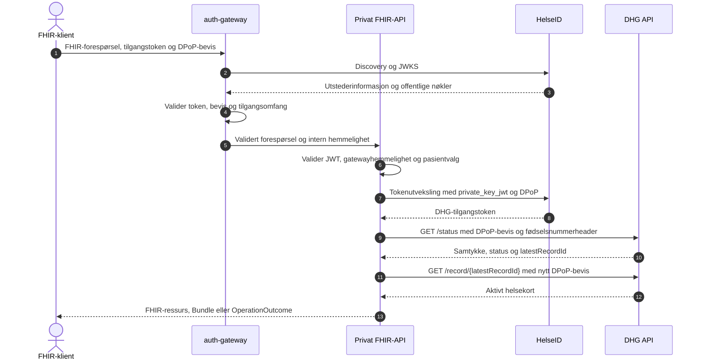

# Oppsett av HelseID

## Registreringer

Autentisert drift krever:

- en API-registrering for fasadens målgruppe og lesetilgang
- en aktørklient med tillatelse til å bytte innkommende subjekttoken mot `nhn:maternity-record` og `nhn:maternity-record/api`
- en privat asymmetrisk JWK for `private_key_jwt`
- en separat privat asymmetrisk JWK for DPoP

I lokal `DevelopmentTestMode` mot DHG Test erstatter HelseID TEST-tokenverktøyet de to private JWK-ene når `HelseIdTestToken:Enabled=true`. Denne flyten krever en autentiseringsnøkkel og en registrert syntetisk testidentitet.

## Autentisert flyt

1. Klienten sender et HelseID-tilgangstoken og et DPoP-bevis til gatewayen.
2. Gatewayen validerer token, tilgangsomfang, DPoP-bevis og gjenbruk av bevis.
3. Det private API-et validerer tokenet på nytt og kontrollerer gatewayens interne hemmelighet.
4. GET-operasjoner validerer `X-Patient-Context`. POST `_search` validerer fødselsnummeret i forespørselskroppen.
5. Det innkommende tokenet brukes som `subject_token` i HelseID-tokenutvekslingen.
6. Det utvekslede DHG-tokenet og et nytt DPoP-bevis sendes til DHG. Det innkommende tokenet videresendes ikke.



I lokal `DevelopmentTestMode` er innkommende Swagger- og FHIR-kall anonyme. `/status` bruker et maskintoken. Når `HelseIdTestToken:Enabled=true`, bruker `/record` et brukertoken med konfigurert syntetisk HPR- og organisasjonskontekst. Modusen godtas bare i `Development` mot DHG Test, med loopback-lytter og kjent loopback-motpart.

## Påkrevd konfigurasjon

Innstillingene ligger under `HelseId`, `HelseIdTestToken`, `AuthGateway` og `PatientContext` i `appsettings.json`. `ClientId`, `ClientAssertionJwk`, `DPoPJwk`, gatewayhemmeligheten og `PatientContext:PatientIdHmacKey` leveres gjennom miljøvariabler, user-secrets eller en annen konfigurasjonsleverandør.

`PatientIdHmacKey` er en separat Base64-kodet hemmelighet på minst 32 byte. Testaliaser godtas ikke i produksjon. Oppstart avvises ved tomt tilgangsomfang, manglende legitimasjon, manglende HMAC-nøkkel i autentisert drift, ukjent DHG-miljø eller blanding av test- og produksjonsendepunkter.

Miljøvariabler for den lokale TEST-tokenflyten:

```text
DevelopmentTestMode__Enabled=true
HelseIdTestToken__Enabled=true
HelseIdTestToken__AuthKey=<secret>
HelseIdTestToken__OrgnrParent=<nisifret-overordnet-testorganisasjonsnummer>
HelseIdTestToken__OrgnrChild=<nisifret-testorganisasjonsnummer-for-behandlingssted>
HelseIdTestToken__ClientTenancyType=1
HelseIdTestToken__PractitionerNationalIdentityNumber=<syntetisk-fødselsnummer-for-helsepersonell>
HelseIdTestToken__PractitionerHprNumber=<syntetisk-hpr-nummer>
HelseIdTestToken__PractitionerName=<syntetisk-navn>
HelseIdTestToken__UserRoleCode=LE
HelseIdTestToken__TreatmentFacilityName=<syntetisk-navn-på-behandlingssted>
HelseId__ClientId=<registrert-testklient-id>
PatientContext__PatientIdHmacKey=<base64-kodet-hemmelighet-på-minst-32-byte>
```

`OrgnrParent`, `OrgnrChild`, fødselsnummer, HPR-nummer, navn, rolle og behandlingssted må beskrive én testidentitet som finnes i NHNs testdata. Returnerte `accessTokenJwt` og `dPoPProof` skal ikke lagres, logges eller gjenbrukes. Tjenesten henter et nytt par for hvert DHG-kall. .NET laster ikke `.env`-filer automatisk.

I lokal utvikling lagres autentiseringsnøkkelen utenfor repositoriet:

```powershell
dotnet user-secrets set "HelseIdTestToken:AuthKey" "<secret>" --project src/PopulationDataFacade.Api
```

`auth-gateway` lytter på HTTP og terminerer ikke TLS. `AUTH_GATEWAY_EXTERNAL_SCHEME=https` angir bare URL-en som brukes ved DPoP-validering. Gatewayen avviser en innkommende `Host` som ikke samsvarer med `AUTH_GATEWAY_EXTERNAL_HOST`. Det private API-et må ligge på en loopback-adresse.

Implementert konfigurasjon for én lokal gatewayprosess:

```text
AUTH_GATEWAY_MODE=authenticate
AUTH_GATEWAY_UPSTREAM_URL=http://127.0.0.1:8081
AUTH_GATEWAY_EXTERNAL_SCHEME=https
AUTH_GATEWAY_EXTERNAL_HOST=<offentlig-vertsnavn>
AUTH_GATEWAY_SHARED_SECRET=<tilfeldig-hemmelighet-på-minst-32-byte>
AUTH_GATEWAY_REPLAY_STORE=memory
AUTH_GATEWAY_SINGLE_REPLICA=true
HELSEID_AUTHORITY=https://helseid-sts.nhn.no
HELSEID_AUDIENCE=nhn:population-data-facade
HELSEID_SCOPE=nhn:population-data-facade/read

AuthGateway__SharedSecret=<samme-tilfeldige-hemmelighet>
```

DPoP-bevisets `htu` må peke på `https://<AUTH_GATEWAY_EXTERNAL_HOST>/<sti-og-spørring>`. `AUTH_GATEWAY_UPSTREAM_URL` må være en HTTP-loopbackadresse uten sti, spørring eller legitimasjon.

## Implementert tilgang

<table>
  <thead>
    <tr><th width="50%" scope="col">Tilgangsvei</th><th width="50%" scope="col">Resultat</th></tr>
  </thead>
  <tbody>
    <tr><td>Gateway i <code>authenticate</code>-modus</td><td>Alle ruter unntatt helsesjekkene krever HelseID-token og DPoP-bevis</td></tr>
    <tr><td>Direkte API i lokal <code>DevelopmentTestMode</code></td><td>Swagger, OpenAPI og FHIR-rutene er anonyme</td></tr>
    <tr><td>Direkte API uten testmodus</td><td><code>GET /<wbr>fhir/<wbr>metadata</code> er anonymt; kliniske FHIR-ruter krever et gatewayvalidert token</td></tr>
  </tbody>
</table>

`POST /test/patient-context/{alias}` finnes bare utenfor produksjon. Uten `DevelopmentTestMode` krever det samme lesetilgang som FHIR-rutene. Se [pasient-ID og beskyttet pasientkontekst](patient-context-testing.md).

Repositoriet har ingen produksjonsutsteder for `X-Patient-Context`. De kontekstbaserte GET-operasjonene har derfor ingen komplett produksjonsflyt. POST `_search` er implementert separat og krever HelseID i autentisert drift.

Når applikasjons- eller DHG-miljøet er produksjon, er Swagger og OpenAPI deaktivert. `Swagger:EnabledInProduction=true` aktiverer rutene med HelseID-kravet `population.read`.
