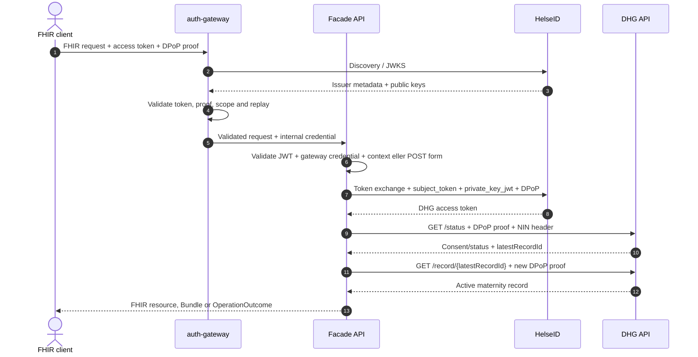

# Oppsett av HelseID

## Registreringer

Fasaden trenger:

- en inbound API registration for konfigurert audience og read scope;
- en actor client som har tillatelse til å bytte innkommende subject token mot `nhn:maternity-record` / `nhn:maternity-record/api`;
- én private asymmetric JWK for `private_key_jwt` client assertions;
- en separat private asymmetric JWK for DPoP.

Bare for eksplisitt Development/DHG Test kan de to private keys erstattes av en godkjent HelseID TEST token-utility auth key sammen med registrert test client og organization claims. Dette unntaket er ikke tilgjengelig i authenticated eller Production operation.

## Request flow

1. Client autentiserer gjennom HelseID og kaller fasaden med et DPoP-bound access token.
2. Auth gateway validerer issuer, audience, lifetime, eksakt read scope, DPoP proof, token/proof binding og replay uniqueness.
3. Den private fasaden validerer access token uavhengig og verifiserer gateway credential. GET-operasjoner validerer i tillegg en short-lived patient context bundet til gjeldende HelseID `sub`; POST `_search` validerer NIN fra form body og lager en HMAC-pseudonym patient ID.
4. Innkommende access token brukes bare som `subject_token` i HelseID token exchange.
5. Det exchanged DHG token og et destination-bound DPoP proof sendes til DHG. Inbound token videresendes aldri til DHG.



Ved lokal testing med Swagger erstatter `DevelopmentTestMode:Enabled=true` steg 1–4 med en anonymous inbound request. DHG tillater machine-to-machine `client_credentials` bare for `/status`. Full uthenting av `/record` krever derfor `HelseIdTestToken:Enabled=true` eller en normal HelseID user-token-flyt. TEST token utility lager et eget request-bound token/proof-par per DHG-kall: `/status` får et machine token, mens `/record` får et user token med konfigurert syntetisk HPR-identitet og organisasjonskontekst. Fasaden sender `nhn-user-role` og `nhn-treatment-facility-name` på journaloppslaget. Modusen krever host environment `Development`, `Dhg:Environment=Test`, loopback-only listeners og en kjent loopback peer. Ikke eksponer denne varianten gjennom reverse proxy, tunnel eller port forwarding.

## Påkrevd configuration

Se `HelseId`, `HelseIdTestToken`, `AuthGateway` og `PatientContext` i API-ets `appsettings.json`. Oppgi `ClientId`, `ClientAssertionJwk`, `DPoPJwk`, gateway shared secret og `PatientContext:PatientIdHmacKey` gjennom en godkjent secret/configuration provider. HMAC key-en skal være en separat Base64-kodet hemmelighet på minst 32 tilfeldige byte og må være stabil på tvers av instanser og restarter. Syntetiske Test aliases er bare tillatt utenfor Production. I TEST-token-unntaket oppgis `HelseIdTestToken:AuthKey` og godkjente syntetiske organization claims i stedet for de to JWK-ene. Startup avviser tomt facade scope, manglende credentials eller HMAC key i autentisert drift, ukjente DHG environment names, blanding av Test/Production og alle forsøk på å aktivere utility utenfor eksplisitt Development Test mode.

Relevant environment-variable-format er:

```text
DevelopmentTestMode__Enabled=true
HelseIdTestToken__Enabled=true
HelseIdTestToken__AuthKey=<secret>
HelseIdTestToken__OrgnrParent=<nine-digit-parent-test-organization-number>
HelseIdTestToken__OrgnrChild=<nine-digit-point-of-care-test-organization-number>
HelseIdTestToken__ClientTenancyType=1
HelseIdTestToken__PractitionerNationalIdentityNumber=<eleven-digit-synthetic-practitioner-nin>
HelseIdTestToken__PractitionerHprNumber=<synthetic-practitioner-hpr-number>
HelseIdTestToken__PractitionerName=<synthetic-practitioner-name>
HelseIdTestToken__UserRoleCode=LE
HelseIdTestToken__TreatmentFacilityName=<synthetic-point-of-care-name>
HelseId__ClientId=<registered-test-client-id>
PatientContext__PatientIdHmacKey=<base64-encoded-random-secret-at-least-32-bytes>
```

Lagre bare stabil auth key og syntetiske testclaims som configuration. `OrgnrParent`, `OrgnrChild`, practitioner NIN/HPR/name, rolle og behandlingssted må beskrive en sammenhengende testidentitet som finnes i NHNs testdata. Ellers kan `/status` lykkes mens `/record` avvises fordi DHG ikke kan etablere user organization context. Returnerte `accessTokenJwt` eller `dPoPProof` må aldri lagres, logges eller gjenbrukes. Provider henter et nytt request-bound par for hvert DHG-kall. En vanlig `.env`-fil lastes ikke automatisk av .NET og må importeres i process environment av developer tooling dersom den brukes.

For lokal Development lagres auth key utenfor repository med:

```powershell
dotnet user-secrets set "HelseIdTestToken:AuthKey" "<secret>" --project src/PopulationDataFacade.Api
```

> **Obligatorisk TLS boundary:** `auth-gateway` lytter med plaintext HTTP. Den terminerer ikke TLS. En trusted HTTPS ingress eller reverse proxy må terminere TLS før trafikken videresendes over en privat loopback/pod-local connection til port 8080. Port 8080 må aldri publiseres direkte til et untrusted network. `AUTH_GATEWAY_EXTERNAL_SCHEME=https` definerer bare canonical URL som brukes ved DPoP validation og forwarded metadata. Innstillingen aktiverer ikke TLS.

Ved authenticated operation skal bare trusted HTTPS ingress eksponeres, og begge containere skal konfigureres med samme tilfeldige secret på minst 32 bytes. TLS terminator må bevare canonical `Host`-verdien konfigurert i `AUTH_GATEWAY_EXTERNAL_HOST`. Gateway avviser andre Host-verdier og bygger forwarding headers på nytt. API-et lytter på loopback port 8081 i container deployment. En single-replica deployment kan eksplisitt bruke `AUTH_GATEWAY_REPLAY_STORE=memory` med `AUTH_GATEWAY_SINGLE_REPLICA=true`. Alle multi-replica deployments må bruke `AUTH_GATEWAY_REPLAY_STORE=redis` med en TLS `AUTH_GATEWAY_REDIS_URL`, slik at replay rejection er atomic på tvers av replicas.

```text
AUTH_GATEWAY_MODE=authenticate
AUTH_GATEWAY_UPSTREAM_URL=http://127.0.0.1:8081
AUTH_GATEWAY_EXTERNAL_SCHEME=https
AUTH_GATEWAY_EXTERNAL_HOST=<canonical-public-facade-host>
AUTH_GATEWAY_SHARED_SECRET=<random-32-byte-or-longer-secret>
AUTH_GATEWAY_REPLAY_STORE=redis
AUTH_GATEWAY_REDIS_URL=rediss://<credentials>@<redis-host>:6380/0
HELSEID_AUTHORITY=https://helseid-sts.nhn.no
HELSEID_AUDIENCE=nhn:population-data-facade
HELSEID_SCOPE=nhn:population-data-facade/read

AuthGateway__SharedSecret=<the-same-random-secret>
```

`AUTH_GATEWAY_EXTERNAL_SCHEME` og `AUTH_GATEWAY_EXTERNAL_HOST` er fast configuration i stedet for caller-controlled forwarded headers, fordi DPoP `htu` validation må bruke canonical public request origin. DPoP proof må peke på `https://<AUTH_GATEWAY_EXTERNAL_HOST>/<path-and-query>`. Requests med en annen `Host`-verdi avvises. Konfigurert upstream må være en HTTP loopback origin. Gateway avviser non-loopback targets.

## Status for test og production

Test alias endpoint er bare tilgjengelig utenfor Production og krever normalt samme read policy som FHIR. I eksplisitt test mode er det anonymous og binder context til konfigurert fixed test subject.

For den eksakte sekvensen alias → logical `patientId` → protected context → FHIR request, inkludert lokal user-secrets configuration og vanlige feil, se [Pasient-ID og protected context for testing](patient-context-testing.md).

Kontekstbaserte GET-operasjoner i Production er blokkert frem til en godkjent patient-context authority og interoperability contract er implementert. Beslutningen må dekke authorization basis, issuer identity, subject/purpose binding, key storage/rotation, replay controls, audit, multi-instance Data Protection og revocation/expiry. POST `_search` er en separat production-flyt: den krever HelseID `population.read`, sender NIN bare i form body, krever stabil `PatientIdHmacKey` og returnerer en pseudonym FHIR patient ID uten NIN.

En ekstern smoke test må velges eksplisitt og bare bruke en godkjent syntetisk pasient. Repositoryet har for øyeblikket ingen slik credentialed smoke harness.

Swagger UI og OpenAPI-document er anonymous i environments som ikke er Production. Kliniske FHIR operations krever normalt et gyldig inbound HelseID DPoP access token. GET-operasjoner krever også protected patient context; POST `_search` krever i stedet NIN i form body og ingen context header. Eksplisitt Development test mode fjerner bare inbound authentication og begrenser POST selection til konfigurerte syntetiske aliaser. Outbound DHG-kall krever fortsatt DPoP-bound HelseID authorization, enten med normal client-credentials/private-JWK flow eller separat aktivert HelseID TEST-token utility. Begge er avhengige av en korrekt autorisert DHG Test client registration.

Når enten host eller DHG environment er Production, er Swagger og OpenAPI deaktivert som default. `Swagger:EnabledInProduction=true` eksponerer `/swagger`, `/swagger/v1/swagger.json` og `/openapi/v1.json`, men alle tre krever normal authenticated HelseID `population.read` policy. Development test mode er fortsatt ugyldig mot Production. Standard browser Swagger kan ikke utføre nødvendig HelseID DPoP flow alene. Interaktiv bruk i production krever derfor en godkjent HelseID-aware backend/reverse proxy som holder tokens og key material på server-side.
