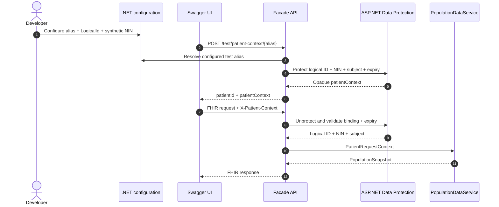
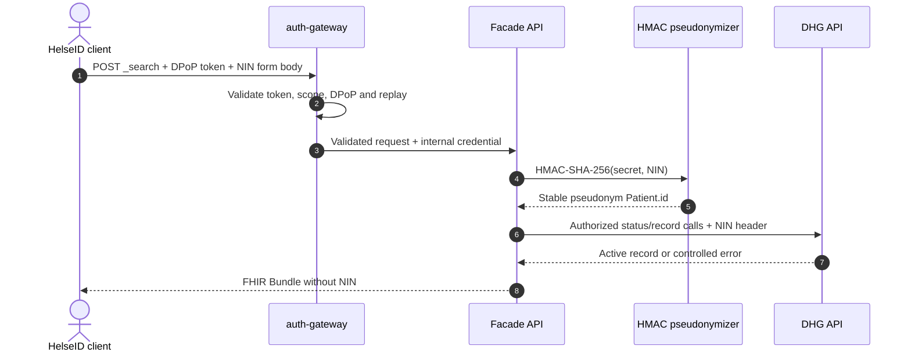

# Pasient-ID og protected context for testing

Denne fasaden skiller bevisst den offentlige FHIR patient ID-en fra fødselsnummeret (NIN). For test-alias velges den logiske `patientId`-verdien i configuration. For autentisert POST `_search` lages den deterministisk med HMAC. Ingen av variantene henter ID-en fra DHG eller eksponerer NIN.

## Verdier som brukes i flyten

| Verdi | Eksempel | Formål |
|---|---|---|
| Alias | `synthetic_1` | Ikke-klinisk lookup name som bare brukes av Test-support endpoint |
| Logical patient ID | `patient-test-1` | FHIR `Patient.id`, route `{id}` og `patient` search value |
| NIN | godkjent syntetisk verdi | Hemmelig identifier som bare sendes i DHGs obligatoriske outbound header |
| Patient context | beskyttet opaque string | Short-lived binding mellom logical ID, NIN, subject og expiry |
| Pseudonym patient ID | `patient-<FHIR-safe-HMAC>` | Stabil FHIR `Patient.id` for autentisert POST `_search`; bruker bare tegn tillatt av FHIR R4 og kan ikke reverseres uten secret key |

Alias og logical ID er ikke DHG identifiers. En operatør velger stabile, ikke-sensitive navn for dem. Bare konfigurert NIN identifiserer den syntetiske personen overfor DHG.



## 1. Konfigurer en syntetisk testpasient

For lokal Development skal NIN holdes utenfor repository med .NET user-secrets:

```powershell
$project = "src/PopulationDataFacade.Api"

dotnet user-secrets set "PatientContext:TestAliases:synthetic_1:LogicalId" "patient-test-1" --project $project
dotnet user-secrets set "PatientContext:TestAliases:synthetic_1:NationalIdentityNumber" "<approved-synthetic-test-nin>" --project $project
```

Start API-et på nytt etter at configuration er endret. Bruk bare en godkjent syntetisk DHG Test-person.

## 2. Utsted protected context

Kjør følgende i Swagger:

```text
POST /test/patient-context/synthetic_1
```

Endpoint slår opp konfigurert alias og returnerer:

```json
{
  "patientId": "patient-test-1",
  "patientContext": "<short-lived-protected-value>"
}
```

Responsen inneholder ikke NIN. `patientId` er nøyaktig den konfigurerte `LogicalId`. Den beskyttede verdien inneholder logical ID, NIN, subject binding og expiry. Default lifetime er ti minutter.

Alle konfigurerte `LogicalId`-verdier må følge FHIR `id`-formatet `[A-Za-z0-9.-]{1,64}`, være unike med case-sensitive sammenligning og være forskjellige fra alle konfigurerte NIN-verdier. Startup avvises hvis disse invariantene brytes.

## 3. Kall FHIR endpoints

For en Patient read i Swagger skriver du inn:

```text
GET /fhir/Patient/{id}

id: patient-test-1
X-Patient-Context: <patientContext returned by the POST>
```

Bruk samme par ved searches:

```text
GET /fhir/Observation?patient=patient-test-1
GET /fhir/Encounter?patient=patient-test-1
```

Logical ID i route eller search parameter må være nøyaktig lik logical ID i protected context. Legg aldri NIN i `{id}` eller en query parameter.

PowerShell-eksempel for eksplisitt lokal Development-test mode:

```powershell
$facadeBase = "https://localhost:7184"
$selection = Invoke-RestMethod `
  -Method Post `
  -Uri "$facadeBase/test/patient-context/synthetic_1"

$headers = @{
  "X-Patient-Context" = $selection.patientContext
  Accept = "application/fhir+json"
}

Invoke-RestMethod `
  -Uri "$facadeBase/fhir/Patient/$($selection.patientId)" `
  -Headers $headers
```

## Autentisert POST search med NIN

De tre FHIR POST `_search`-operasjonene er tilgjengelige i autentisert drift, inkludert Production. De krever et HelseID DPoP access-token som oppfyller `population.read`, men ikke `X-Patient-Context`. NIN oppgis bare i en `application/x-www-form-urlencoded` request body. DHGs consent-, personstatus- og active-record-kontroller kjøres som ellers.



`PatientContext:PatientIdHmacKey` må være en Base64-kodet tilfeldig hemmelighet på minst 32 byte og leveres fra en godkjent secret store. Samme key må brukes av alle instanser. Rotasjon endrer de pseudonyme FHIR-ID-ene og krever derfor en eksplisitt migreringsbeslutning. Key-en må aldri gjenbrukes som gateway credential, Data Protection key eller HelseID private key.

DPoP proof er bundet til eksakt HTTP method og URL og må derfor være nytt for hvert POST-kall. Se [FHIR-eksempler](../examples/fhir-queries.md) for request-format. Et ellevesifret, men ukjent NIN går videre til DHG og gir en kontrollert respons basert på DHGs consent/status/record-resultat; fasaden gjengir ikke verdien.

## Valgfritt lokalt search med syntetisk NIN

En eksplisitt lokal `DevelopmentTestMode` host eksponerer også FHIR POST `_search` operations som ikke krever `X-Patient-Context`. De godtar bare et ellevesifret NIN som er nøyaktig likt ett konfigurert test-alias. NIN oppgis i en `application/x-www-form-urlencoded` request body og returneres aldri. Resources fortsetter å bruke aliasets konfigurerte logiske `patientId`.

Bruk følgende i Swagger:

```text
POST /fhir/Patient/_search
  identifier: <approved-configured-synthetic-nin>

POST /fhir/Observation/_search
  patient.identifier: <approved-configured-synthetic-nin>
  code: <optional-system|code>

POST /fhir/Encounter/_search
  patient.identifier: <approved-configured-synthetic-nin>
```

PowerShell-eksempel:

```powershell
$facadeBase = "https://localhost:7184"
$approvedSyntheticNin = Read-Host "Approved configured synthetic NIN"

Invoke-RestMethod `
  -Method Post `
  -Uri "$facadeBase/fhir/Observation/_search" `
  -ContentType "application/x-www-form-urlencoded" `
  -Body @{ "patient.identifier" = $approvedSyntheticNin }
```

Ikke bruk `GET /fhir/Observation?patient.identifier=<NIN>` eller en tilsvarende Patient/Encounter-URL. Query strings kan bli lagret i browser history, ingress logs, access telemetry og intermediary systems. Et ukjent eller ikke-konfigurert NIN gir `404` i lokal `DevelopmentTestMode` uten å gjengi den oppgitte verdien. Utenfor denne modusen finnes de samme POST-routene, men da med obligatorisk HelseID og pseudonym HMAC-ID som beskrevet over.

## Vanlige responser

| Respons | Betydning |
|---:|---|
| `404` fra Test-support POST | Aliaset er ikke konfigurert. Konfigurer både `LogicalId` og `NationalIdentityNumber`, og start deretter på nytt |
| `400` fra en FHIR operation | Context header mangler, er ugyldig eller har utløpt. For lokal POST `_search` kan request body også være ugyldig |
| `401` fra POST `_search` | HelseID access-token mangler eller er ugyldig utenfor lokal `DevelopmentTestMode` |
| `403` fra POST `_search` | Autentisert subjekt mangler fasadens påkrevde `population.read` scope, eller DHG avviser tilgangen |
| `404` som sier at pasienten ikke ble funnet i denne context | Logical ID i route/search samsvarer ikke med returnert `patientId` |
| `403` fra en DHG-backed operation | DHG rapporterer manglende consent eller en annen forbidden state |
| `404` fra en DHG-backed operation | DHG rapporterer at det ikke finnes en active maternity record eller matchende syntetisk pasient |
| `500`/`503` som nevner HelseID eller DHG | Kontroller TEST credentials, claims, endpoint connectivity og API terminal log/correlation ID |

Utsted en ny context etter at lifetime har utløpt, eller etter en application restart som erstatter lokale Data Protection keys. Context skal behandles som sensitiv. Ikke lim den inn i source control, logs, issues eller chat.

## Environment boundary

Alias-endpointet er test support, ikke en production patient-selection protocol. Det er utilgjengelig når host eller DHG security boundary er Production. En production patient-context authority og trust contract må godkjennes før de kontekstbaserte GET-operasjonene brukes klinisk. Production patient selection gjennom POST `_search` er en separat HelseID-beskyttet flyt og krever stabil HMAC key samt gjennomført security/privacy review.
