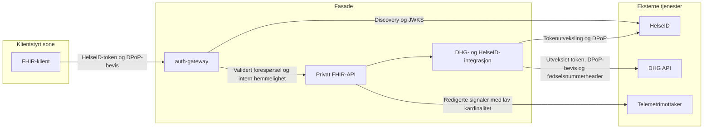

# Sikkerhetsarkitektur

## Tillitsgrenser

FHIR-laget mottar ikke DHG JSON-stier og bruker ingen alternativ datakilde. Fødselsnummer mottas bare i pasientkonteksten eller i POST `_search`-kroppen og sendes videre i DHGs påkrevde header. Fødselsnummer brukes ikke som FHIR-identifikator og returneres ikke i svar.

## Implementerte sikkerhetskontroller

- Validering av HelseID-token og DPoP-bevis i Go-gatewayen.
- Kontroll av tokenformat, utsteder, én målgruppe, levetid, tilgangsomfang, signatur, `htm`, `htu`, `ath`, `cnf.jkt` og unik `jti`.
- Ny JWT-validering og kontroll av intern gatewayhemmelighet i det private .NET-API-et.
- Fjerning av klientstyrte proxyheadere og interne gatewayheadere før videresending.
- Kortlivet, subjektbundet pasientkontekst med ASP.NET Data Protection.
- HelseID-beskyttet POST `_search` med fødselsnummer i forespørselskroppen og pseudonym `Patient.id`.
- Kontroll av samtykke, personstatus, aktivt helsekort, post-ID og statusen `ACTIVE` før mapping.
- Oppstartsvalidering som avviser blanding av test- og produksjonsendepunkter.
- Separate nøkler for klientpåstand og DPoP.
- Ingen varig klinisk mellomlagring, alternative datakilder eller reservedata.
- `Cache-Control: no-store` på FHIR-svar.
- Normaliserte DHG-spor uten dynamisk post-ID i URL-attributter.
- `OperationOutcome` uten rå feilsvar fra HelseID eller DHG.
- Swagger og OpenAPI er deaktivert som standard i produksjon og krever HelseID når de aktiveres.

Repositoriet implementerer ikke en produksjonsutsteder for `X-Patient-Context`. Derfor er den komplette produksjonsflyten for de kontekstbaserte GET-operasjonene ikke tilgjengelig. POST `_search` er en separat implementert flyt.

Se [sikkerhet](security.md) og [oppsett av HelseID](helseid-setup.md).
