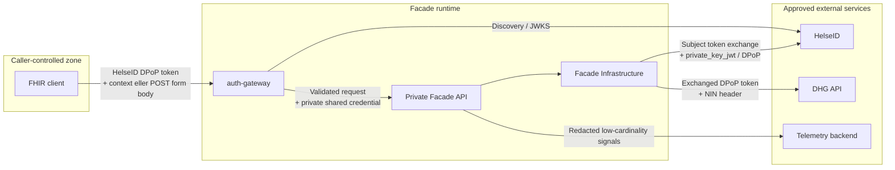

# Security-arkitektur

## Trust boundaries

Development test mode endrer bare de to første pilene: Swagger/FHIR-caller er anonym, og fasaden henter DPoP-bound DHG authorization server-side. Normalt brukes `client_credentials`; en ekstra HelseID TEST-token provider som er disabled by default, kan i stedet opprette et nytt token/proof-par for hver eksakte DHG request, i samsvar med smartOppgaves test flow. Modusen krever lokal Development, loopback-only listeners og en kjent loopback peer; eksponering via proxy, tunnel eller port forwarding er forbudt. Den krever DHG Test og avvises i alle andre environments og mot Production.

FHIR layer mottar aldri DHG JSON paths eller en alternativ data source. NIN kan mottas transient i en liten POST form body og inngår derfra i request context før det sendes i påkrevd outbound DHG header. I autentisert drift krever POST-ruten HelseID `population.read` og danner en deterministisk pseudonym FHIR-ID med en separat HMAC-SHA-256 key. I lokal `DevelopmentTestMode` må NIN i stedet matche et konfigurert syntetisk alias. NIN er aldri en FHIR identifier, URL parameter, response field, log field eller telemetry tag.

## Implementerte controls

- inbound HelseID access-token- og DPoP-validation i Go auth gateway med `golang-jwt`, `keyfunc` og NHNs anbefalte `AxisCommunications/go-dpop` library
- eksakte kontroller av `at+jwt` type, issuer, single audience, expiry, not-before, scope, proof signature, `htm`/`htu`, ti sekunders freshness, `ath`, `cnf.jkt`, asymmetric public JWK og unik `jti`
- uavhengig JWT validation i privat .NET API, som også krever en delt gateway credential kontrollert i constant time
- gateway-stripping av caller-supplied internal credentials og deployment ingress rettet bare mot gateway-porten
- FHIR `OperationOutcome` for authorization- og application failures
- subject-bound, time-limited Data Protection patient context
- HelseID-beskyttet POST `_search` med NIN bare i form body og stabil HMAC-pseudonym `Patient.id`; GET-query med NIN avvises
- gates for consent, deceased, active record, record ID og `ACTIVE` status før mapping
- HTTPS-only configuration og lukket Test/Production environment validation
- separate konfigurerte roller for client assertion key og DPoP key
- ingen persistent clinical cache eller runtime fallback data
- no-store FHIR responses
- normaliserte DHG activity tags og undertrykking av generiske DHG URL spans
- kontrollerte correlation IDs og ingen raw upstream error body i client responses
- Production Swagger/OpenAPI er disabled by default når host- eller DHG environment er Production, og beskyttes av normal HelseID read policy når det aktiveres eksplisitt; interactive UI krever en godkjent HelseID-aware backend/proxy fordi standard Swagger UI ikke implementerer nødvendig DPoP-håndtering

## Production gates

- implementer og godkjenn production patient-context authority før de kontekstbaserte GET-operasjonene tas i bruk; HelseID-beskyttet POST `_search` er en separat implementert selection flow
- lagre og roter `PatientContext:PatientIdHmacKey` som en separat, delt driftshemmelighet; rotasjon endrer pseudonyme patient IDs og må koordineres
- konfigurer en delt kryptert Data Protection key ring for mer enn én instance
- konfigurer Redis atomic replay store før mer enn én instance kjøres; memory store nekter startup med mindre single-replica operation er eksplisitt deklarert
- generer og roter en tilfeldig delt gateway credential på minst 32 bytes, og hold API-porten privat i sidecar network
- godkjenn eksakte HelseID/DHG host allowlists og deployment egress policy
- konfigurer trusted proxies, canonical public FHIR URL og allowed hosts
- legg til meningsfull readiness semantics og kontrollert ekstern synthetic monitoring
- fullfør reell HelseID Test/DHG Test interoperability, penetration-, privacy- og clinical terminology review
- etabler locked restore, CI security gates, immutable image policy og rollback evidence

Se [security.md](security.md) for operative detaljer og [helseid-setup.md](helseid-setup.md) for identity configuration.
